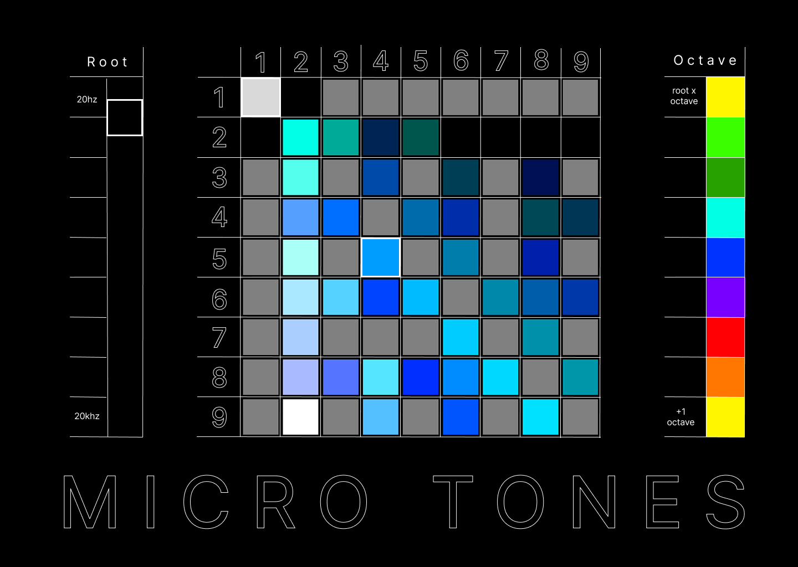

# Micro Tones

## What is it?
A browser based app for making chords/drones composed of unusual musical intervals. The root note is adjustable. 

## Background
Micro Tones is named after the idea of microtonality. I.e. the 

